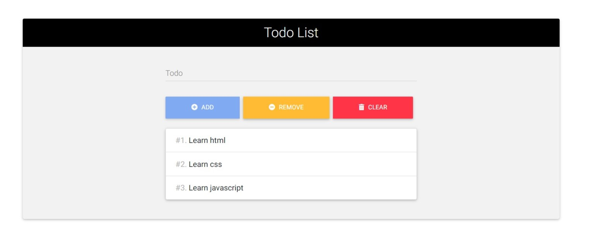

### Todo Application. ###

----
Simple application which allows to add tasks, remove last task and remove all tasks. 

Validation has been done for the buttons and input value. Validation for input value reaziled by **RegEx**.

Todo List saves into **local Storage**, so you can be sure your data will be saved after reloading the page.

Application was made using **ReactJS**.

For styling was used [MDBootstrap UI Kit.](https://mdbootstrap.com/docs/react/)

